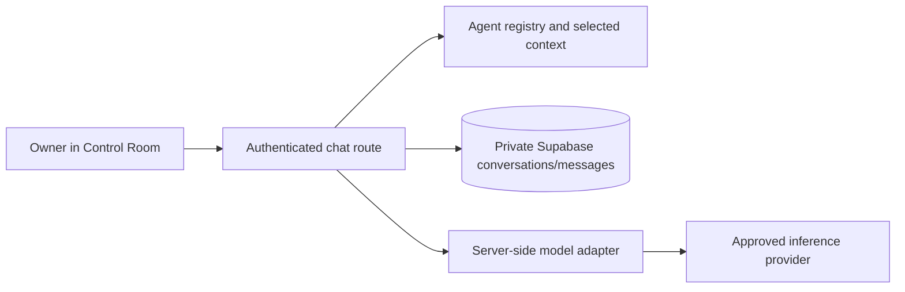

# Control Room agent communication: owner discovery review

October 7, 2026 · inspected checkpoint `a149a6e089f2e13f455378117d0f49561ccfd52c`. Repository inspection and official documentation research only. No production/provider account queries, credential inspection, implementation, installs, commits, pushes or deployments.

**Recommended Phase 1:** private, persisted, conversation-only chat using existing authentication and Supabase, an extensible agent registry and one server-side model adapter. George and William start as the first roles. This eliminates prompt/report copying for these **new conversations**; it does not automatically resume the agents in this IDE. If exact existing-session continuity is required, validate a Codex bridge before choosing the runtime.

## 1. Current Control Room

Next.js 16.3.4 App Router, React 19, TypeScript and CSS modules. `/admin` shows sign-in or a dashboard with metric cards, Search Console trends, integration states, Email access and provider links. Server loaders retrieve Beehiiv newsletter snapshots, finalized 28-day Google Search data and 30-day Resend email metrics, with unavailable/not-connected states. Dashboard Cloudflare traffic remains a placeholder despite the public analytics beacon. Website/deployment cards are not live health checks. Implementation is verified; current provider connectivity was not tested.

`/admin/email` provides persisted mailbox/thread browsing, read/unread, trash, compose/reply and protected attachments. `/admin/mail` is the older composer. No agent selector, AI chat, model client, agent tables or execution queue exists in application code. `ConversationHistory` renders email history, not AI conversations.

## 2. Relevant existing files

Paths are relative to the repository root.

| Area | Files/routes | Reuse |
|---|---|---|
| Dashboard | `app/admin/{page,layout}.tsx`; `components/admin/ControlRoomDashboard.tsx`, `AdminBrand.tsx`, CSS modules | Private visual language/navigation |
| Email UI | `app/admin/email/page.tsx`; `components/admin/{MailInbox,ConversationHistory,MailActions}.tsx` | Thread/history layout patterns |
| Access | `lib/admin/{auth,session,request-security,rate-limit}.ts`; `components/admin/{LoginForm,AdminSessionGuard}.tsx` | Session/origin checks, expiry UX |
| HTTP APIs | `/api/admin/login`, `/logout`, `/send`; `/api/admin/email/{send,read-state,trash-state,attachments/[attachmentId]}` | Route-handler conventions; no agent APIs/relevant server actions found |
| Integrations | `lib/admin/integrations/{catalog,load,types}.ts` and Beehiiv/GSC/Resend clients | Adapter/error-state pattern |
| Storage | `lib/supabase/server.ts`; `lib/mail/{read,inbound,outbound,actions,attachments}`; `types/supabase.ts`; `supabase/migrations/` | Server repositories/migrations |
| Agents/context | `AGENTS.md`; `docs/agents/{george,william}.md`; `growth/`; `docs/measurement/resource-growth.md` | Roles, constraints, selected project records |
| Boundary | `components/PublicSiteBoundary.tsx`; `next.config.ts`; `app/robots.ts` | Private cache/indexing headers; no public chrome/beacon under `/admin` |

## 3. Authentication/security today

One environment-configured owner login: username plus six-digit PIN checked with bcrypt. HMAC-signed stateless sessions last 30 minutes; cookie is HttpOnly, SameSite Strict and Secure in production. Protected pages/APIs validate the session; client expiry redirects to sign-in. The admin layout itself is not an authorization gate: every new page/endpoint must check access before private reads.

Mutations enforce same-origin and bounded JSON. Login protection uses instance-local attempts plus a signed cooldown cookie, not distributed throttling. No per-user accounts, MFA, granular roles or server-side revocation list was found. Logout clears the browser cookie; a copied valid token remains valid until expiration. Existing auth is reusable for an owner-only conversation pilot; login must not grant agents production authority.

## 4. Database/storage reuse

The server-only Supabase client uses `SUPABASE_URL` and `SUPABASE_SECRET_KEY`, without browser session persistence. Mail schema demonstrates UUIDs, timestamps, foreign keys, idempotency indexes and RLS with anon/authenticated privileges revoked and service-role access. Reuse the existing project and these patterns, with **separate chat tables**; mail tables require email/mailbox semantics.

Attachments currently have metadata/optional future storage references; authenticated downloads retrieve content from Resend. No established durable agent-file bucket was found. Text chat needs none. Growth receipts/aggregates are dedicated measurement data and stay untouched. Repository migrations/types do not establish current live mail schema, bucket state, quotas or backup coverage.

## 5. How George and William operate

They are instruction-defined Codex agents in this shared workspace, not deployed services. Their role documents and `AGENTS.md` guide the host runtime. Local scripts, approved provider operations and reports/publication records support their work. Names alone do not identify resumable API threads.

George handles growth/content/distribution; exact approved batches can be scheduled under explicit authorization. William measures and preserves evidence quality; his role prohibits production changes/publishing. Latest project records identify George's October 12–18 batch as scheduled and William's resource baseline as active. These dated records are not runtime heartbeats or proof of current execution.

## 6. What prevents communication

No runtime endpoint, agent/session mapping, model integration, registry, persisted chat or context contract exists. Provider integrations are not agent transports. Role Markdown does not start an agent; imported reports do not reproduce IDE conversation memory or permissions.

## 7. Smallest viable architecture

Proposed only:

Add an Agents entry and `/admin/agents`. Registry entries contain stable ID, display name, role, instruction version, capability policy and approved context references. Future Newsletter/HVAC Intelligence and Email/Communications roles add entries without changing chat schema. Responsibility summaries carry source/last-updated time; do not invent online or current-task states.

Two private tables suffice: `agent_conversations` (agent, title, owner scope, definition version, timestamps) and `agent_messages` (conversation, sequence, role, text, request ID, reply status, provider/model/usage references, timestamps). Use unique request IDs, enforce agent/thread ownership and serialize overlapping turns. The rotating session nonce is not a permanent owner identity.

An authenticated bounded send route saves the message, assembles versioned instructions plus selected records/recent history, calls the adapter and saves the reply. Show pending/completed/failed/unknown honestly; never automatically replay an uncertain paid request or fabricate persistence success. Cap output/history within verified request-duration limits. Start without streaming, uploads, vector search, orchestration or background jobs. The Responses API supports client-managed history, so Supabase can remain the transcript source of truth. [Conversation-state documentation](https://developers.openai.com/api/docs/guides/conversation-state).

## 8. Local versus external execution

| Option | Capability | Additional boundary |
|---|---|---|
| **Recommended: server-side role chat** | New conversations using canonical George/William definitions and curated records | External inference; no automatic IDE memory/workspace tools |
| Local Codex app-server bridge | Codex thread/turn execution and possible resumption of mapped accessible threads | Local runner, scoped authenticated transport/job claiming, availability and permission isolation |
| Fully local model | Inference without cloud prompt transfer | Suitable hardware, maintained runtime and quality evaluation |

Codex app-server exposes thread start/resume and turn events; its SDK also supports resumption. This establishes an integration route, **not proof that this chat's child-agent sessions are accessible through it**. Validate mapping or identify newly created threads explicitly. Prefer outbound claiming of tightly scoped jobs over a public shell endpoint. No protocol was exercised. [App-server](https://learn.chatgpt.com/docs/app-server), [Codex SDK](https://learn.chatgpt.com/docs/codex-sdk).

Vercel request invocations have finite duration. A persistent local workspace agent requires separate execution and durable job/offline handling rather than assuming it can live inside an ordinary website request. [Function limits](https://vercel.com/docs/functions/limitations).

## 9. Free-first options/cost

Reuse Next.js, Supabase and hosting. A text pilot may fit existing allowances; actual plans, remaining capacity and inference entitlements were not inspected. Supabase has a free tier with capacity/backup limitations. [Supabase pricing](https://supabase.com/pricing).

API-key inference is usage-billed; a ChatGPT subscription is not automatically an API-key allowance. Codex subscription authentication may avoid a new inference bill within existing entitlements, but remains quota-limited. A local model consumes hardware/electricity. [Codex authentication](https://learn.chatgpt.com/docs/auth).

For API chat, select a model and approve a small hard application-side daily request/token budget before implementation. Track usage, bound context/output and refuse over-budget requests. Cost depends on selected model and tokens, including repeated context; no specific dollar estimate follows from this repository. No paid orchestration/vector service is necessary. [API pricing](https://developers.openai.com/api/docs/pricing).

## 10. Agent permissions and privacy

Keep model/database credentials server-side; never pass the production environment wholesale to prompts or a local runner. Service-role access bypasses ordinary RLS restrictions, so server query scoping is essential. Render text or sanitized Markdown, with private uncached responses outside public indexing/analytics.

Phase 1 exposes **no execution tools**: no shell, Git writes, deployments, Buffer mutations, sending mail, payments or measurement changes. Chat text claiming approval is not executable authorization. Later actions need separately enforced approval tied to exact inputs/version; models cannot approve themselves. Treat imported documents/mail as untrusted context, not privileged instructions. Never automatically load customer mail, subscriber identities, secrets or arbitrary repository files.

Approve provider data transfer and retention separately: selected history/instructions leave our server during API inference. `store:false` reduces response application-state storage but does not itself eliminate abuse-monitoring retention. Private chat transcripts belong in the database, not Git/public media. [OpenAI data controls](https://developers.openai.com/api/docs/guides/your-data).

## 11. Phase 1 interaction

Sign in → Agents → George/William → role, dated responsibility summary and “Conversation only” capability → existing thread/New conversation → send text → saved message plus reply/error → return later with history preserved. Show which context records were used. Provider unavailable means no inference, not a fake response/online status. No production-action approval buttons in this phase.

## 12. Phased plan

1. **Scope gate:** accept new role conversations or require exact existing-session continuity. Confirm runtime access, budget, allowed context and retention. If continuity is essential, separately authorize an isolated bridge feasibility check first.
2. **Authorized local implementation:** registry, private workspace, two-table migration, repository and adapter. Test with a fake provider first; separately authorize bounded real inference. Verify auth/origin/expiry, isolation, duplicate sends, safe rendering and failure/context exclusions.
3. **Separately approved production pilot:** apply reviewed migration/deploy chat only, verify real replies and reload/history, record usage/latency/failures. Preserve the baseline and scheduled posts.
4. **Expand when needed:** more registry entries, selected read-only tools/context refresh; local workspace bridge/jobs/action approvals only for demonstrated needs. Publishing, mail and payments remain separate permissions.

**Discovery outcome:** only this report was added. No application/configuration/schema/dependency changes or runtime tests/build were needed. Existing 25 local artifacts remain untracked; no commit/push/deploy occurred. Live provider availability and exact-session bridge feasibility remain unverified.
