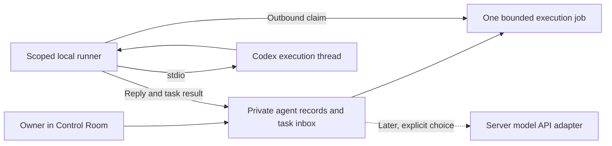

# Existing-agent continuity: owner feasibility review

October 7, 2026. Discovery only; no bridge, inference turn, service, tunnel, installation or production operation was performed. Builds and runtime tests were not run. This supplements [the initial discovery](2026-10-07-control-room-agent-communication.md).

**Recommendation: C, a small hybrid with Codex as the first candidate execution backend.** Control Room should own George's and William's identities, responsibilities, conversation/task records and approved project state. Codex thread IDs should be replaceable execution references. First authorize a separate, isolated continuity proof-of-concept before implementing the conversation UI. Direct reuse of the existing threads is **not established** and has a documented history-format obstacle. Do not quietly substitute fresh role chats and describe them as the existing sessions.

## A / B / C comparison

| | A. New server-side role agents | B. Direct existing Codex bridge | C. Hybrid persistent agents |
|---|---|---|---|
| Identity/history owner | Application roles and new chats | Particular Codex threads/local store | AnyHVAC agent IDs and canonical records |
| Existing workflow continuity | Requires deliberate import; separate IDE work can diverge | Closest transcript continuity if exact threads resume | Shared operational state; reuse threads when possible, replace when necessary |
| Owner synchronization | Unacceptable if independent IDE chats continue | Low only if all clients address the same threads and see updates | Low if every supported entry point writes through the same task/history contract |
| Laptop off | Server inference can reply | Local execution stops; separate host would be needed | Inbox/state remain available; Codex jobs wait, or an explicitly selected hosted backend replies |
| Complexity | Lowest for text chat | Local process, thread compatibility, lifecycle and concurrency | Slightly larger data model; start with one adapter, no multi-agent orchestration |
| Cost shape | Token usage plus existing hosting/database quotas | Existing entitlement may cover inference; runner/availability costs remain | Same chosen-backend costs; API fallback optional, never silently enabled |
| Fit | Does not meet continuity preference by itself | Useful feasibility target, fragile as permanent identity | Recommended operational design |

## 1. What George and William are today

`docs/agents/george.md`, `docs/agents/william.md` and root `AGENTS.md` define their roles and approval boundaries. They work through the Codex host with repository access and available tools. Reports, approved batch records, scheduling receipts and measurement handoffs live in the repository. This is not an AnyHVAC-deployed agent service or a continuously running business scheduler. The website's existing integrations retrieve provider data; they do not invoke these agents.

Read-only inspection of AnyHVAC rows in local Codex metadata found historical child threads beneath parent `01a111f0-2553-78b0-a020-29a9d3224aee`:

| Logical agent | Recorded path | Candidate thread ID | Last metadata update (UTC) |
|---|---|---|---|
| George | `/root/george` | `01a111f0-ccd6-7290-8fcb-0662109ec08d` | 2026-10-06 18:17:28 |
| William | `/root/william` | `01a111f0-77da-78b0-9619-fafd6bb8e4b8` | 2026-10-06 17:56:32 |

Both backing rollout paths exist; both metadata records say `history_mode=paginated`, created with `0.159.0-alpha.12.1`. Their generated nicknames differ from the business names: identify them by verified path and provenance, not nickname. The installed VS Code extension bundles CLI `0.160.1`. Metadata timestamps establish neither current availability nor complete role memory. Later completed work is also recorded in the parent conversation and repository; one child transcript cannot be presumed to contain all of it. The current host's agent listing returned only the root agent.

Inspection read selected metadata, not transcripts, credentials or unrelated projects. The local SQLite schema is private implementation detail used for this discovery, **not a proposed production integration contract**.

## 2. Interfaces and the precise feasibility gap

Official app-server provides `thread/read`, `thread/resume`, `turn/start`, completion events and approval exchanges. Thread listing defaults to CLI/VS Code sources; subagent sources need explicit inclusion. `thread.id` targets resumption; `sessionId` describes the live session-tree root, not a business identity. **The same documentation says existing paginated records can be listed but full-history reads and resume fail closed until supported.** Both candidate threads have that format. This is a documented blocker to assuming the advertised path works here, not an observed failed resume. Default stdio avoids opening a listener; TCP WebSocket transport is documented as experimental/unsupported. [App-server documentation](https://learn.chatgpt.com/docs/app-server).

Other documented/installed choices:

- CLI `codex exec resume <SESSION_ID>` resumes recorded work; JSON output supports job integration. Installed help confirms UUID/name targeting. `--last` is unsuitable for agent routing. [Non-interactive mode](https://learn.chatgpt.com/docs/non-interactive-mode).
- Official TypeScript SDK has `resumeThread(id)`; Python SDK controls app-server. Neither a method name nor installing a different SDK proves these particular paginated child threads are compatible. [Codex SDK](https://learn.chatgpt.com/docs/codex-sdk).
- Installed CLI help also exposes `codex queue --thread ... --message ...`, `agents`, and app-server daemon/proxy commands. No message was queued and no daemon was started. Queue behavior, persisted reply retrieval and cross-client visibility need proof; do not use it as an assumed reliable API.
- MCP can expose narrowly scoped AnyHVAC context/task tools to Codex; it does not inherently address an existing conversation or wake an offline runner. [MCP](https://learn.chatgpt.com/docs/extend/mcp?surface=cli). The former `codex mcp-server` interface has been removed; avoid older tutorials. [SDK documentation](https://learn.chatgpt.com/docs/codex-sdk).
- Managed remote-control commands exist, but official guidance distinguishes them from a custom app-server client. They are not evidence of an AnyHVAC-callable relay API. No pairing, remote-control or debug turn was attempted. [Developer commands](https://learn.chatgpt.com/docs/developer-commands).

A read-only daemon-version check failed to reach the sandbox account's socket; login status said “Not logged in.” The shell used `CodexSandboxOffline`, not the owner's credential context. These results do **not** prove that the IDE is signed out, that the owner's daemon is absent, or that the candidate threads cannot resume. Do not copy credentials to overcome that boundary during discovery.

**Verdict for B:** real persisted candidates exist and documented programmatic interfaces exist. Actual resumption, permissions, child-thread independence, history completeness and IDE visibility remain unverified. Do not promise exact-session continuity or make private database access the bridge.

## 3. Recommended hybrid: one operational George, one operational William

Use stable `george` and `william` registry IDs; future roles add entries. Keep responsibilities, definition versions, permission policy, dated project facts, tasks and user-visible messages in existing private Supabase infrastructure. A backend binding records agent ID, conversation/task ID, backend kind, runner ID, Codex thread ID, definition/context revision and latest acknowledged event/turn. Multiple execution threads may belong to one agent; no single everlasting transcript defines the agent.

Add only a small task/run record to the prior conversation/message proposal: request ID, state, selected backend, execution binding, lease/attempt, result reference and timestamps. One adapter initially. No vector database, agent framework, message broker, cross-agent chat or automatic scheduler is needed for the pilot. This is a proposed schema, not an existing capability.

Each job receives canonical responsibilities, explicit owner request, selected current facts and relevant conversation/task history. Results return into the same records with provenance. Backend changes preserve those records and visible history, **not hidden reasoning, exact model behavior or uninterrupted execution**. Import existing completed handoffs once, with source and date; do not invent an agent memory or reclassify past approval as standing permission for new actions.

Owner workload remains low only with a single write path. Initial pilot: send through Control Room; Codex is execution, IDE is review/workspace access. Arbitrary independent IDE prompts will not magically synchronize. If IDE remains a second input surface, later implement a supported adapter or scoped MCP tools that read/write the same task contract and automatically record results. Generic MCP does not enforce this on every IDE message. Until proven, mark independent work as outside the shared conversation and do not claim seamless two-way synchronization.

The product can say “George” throughout and show backend/availability details secondarily. Queueing when the runner is offline is honest continuity. Do not present cached records as current agent activity or silently switch to a separate API persona when a Codex job is unavailable.

## 4. Runtime, authentication and security

For local Codex execution, a host with the runner, Codex runtime, accessible thread store, project context, network and valid model authentication must be awake. VS Code itself need not remain open if the runner owns execution; independently resuming an IDE-owned thread still requires concurrency/visibility proof. Laptop sleep/offline stops local work. Inbox/history can remain available on Vercel/Supabase. Computer-off execution needs a separate always-on host or hosted model/runner; moving thread state and authentication is a separate reviewed operation, not an automatic cloud resume.

Prefer outbound HTTPS job claiming from a dedicated runner to the existing private application. No inbound port, tunnel or public shell endpoint. Use a future scoped, revocable runner credential with only assigned-agent job/context/result access. Do not place Supabase service credentials or the owner's admin cookie on the worker. Browser uses existing owner authentication; server verifies owner/agent/conversation scope, origin, payload size and rate limits on every request. Existing 30-minute owner sessions are not durable agent identities. Stronger owner authentication/revocation should precede granting any execution authority beyond isolated read-only work.

Codex supports ChatGPT or API-key authentication; CLI/IDE can share cached login. API-key usage is billed separately. Cache files/tokens must remain private; account entitlement was not established here. [Authentication](https://learn.chatgpt.com/docs/auth). A documented Sign in with ChatGPT plan-usage path also exists, but the published scope is open-source/local apps; remotely hosted offerings require an interest process. It grants eligible inference, not access to existing ChatGPT conversations. Do not assume this Vercel app qualifies or reuse an IDE token as a general web API key. [Plan-usage overview](https://developers.openai.com/siwc/token-sharing-open-source).

The runner is the serious trust boundary. A compromised admin session or malicious imported report could otherwise drive a credential-bearing development machine. An approval prompt and read-only filesystem alone do not prohibit network writes or data exfiltration. For the proof-of-concept, use a sanitized read-only project copy, isolated OS/container boundary, minimal environment, no production tokens, no inherited integrations/hooks, and enforced network/tool restrictions. Allow model access only as needed; block production/provider endpoints and side-effect tools. Reject elevation requests rather than automatically accepting them. Never use bypass flags.

Do not expose raw session history publicly or import unrelated personal conversations. Treat retrieved context as untrusted data; sanitize rendered output and cap input/output. Registry policies and tool enforcement determine authority, not wording in a chat. Future production actions need separately authorized, exact, auditable commands outside the conversation executor. George's previous approved batch and William's baseline do not authorize any new operation.

## 5. Costs, free-first choices and maintenance

- **Lowest incremental service cost candidate:** existing local Codex access, one outbound runner and existing database/hosting allowances. Included model usage depends on actual plan, limits and supported authentication. Existing subscription is still a cost; extra credits, electricity and maintenance are possible. No entitlement or zero-cost guarantee was verified.
- **API alternative:** chargeable input/output tokens at selected-model rates; estimate monthly cost from measured pilot tokens and turns, then approve a cap. No defensible dollar estimate exists without workload/model selection. Context growth increases cost. [API pricing](https://developers.openai.com/api/docs/pricing).
- **Always-on execution:** an existing suitable dedicated machine can avoid a new hosting bill; a new hosted runner adds compute, storage and operational cost. A free hosting tier is not assumed to support durable Codex execution. The ordinary website deployment is not a substitute for the local runtime.
- **Local open model:** installed CLI supports local-provider options, but hardware, model quality and workflow compatibility were not evaluated. It is a possible execution backend for C, not a way to resume cloud-model memory identically. No model/package download is proposed now.
- **Plan-usage OAuth:** future eligibility/consent, token renewal and preview restrictions require validation. The documented configuration preserves local history but needs token renewal/restart handling; it is not a free continuity API. [Preview limitations](https://developers.openai.com/siwc/token-sharing-open-source/preview-limitations).

Minimum reliability requirements: serialize jobs per agent/thread, persist before dispatch, unique request IDs, bounded leases/heartbeats, explicit queued/running/completed/failed/unknown states, and recover visible replies after reconnect. A lost result must not blindly replay an uncertain turn. Import completed results by stable event/turn IDs where available; do not promise exactly-once inference. Reject stale context revisions rather than overwriting newer task state. Initial read-only jobs reduce the consequences of retries but still cost usage.

Pin a tested runtime/protocol version and run a small compatibility test before upgrades. Keep backend/thread references replaceable. Avoid direct SQLite/rollout writes, DOM automation, internal VS Code commands, browser-token extraction and undocumented cloud endpoints. The observed history-format/version mismatch illustrates why permanent-thread identity is a maintenance liability.

## 6. Smallest separately authorized proof-of-concept

This is a proposed validation plan; **none of these execution steps was performed**.

1. In the owner's correctly authenticated context, confirm the installed runtime and supported protocol. Using stdio and documented read methods only, determine whether the two known child IDs are discoverable and readable. Handle subagent filtering. Do not migrate, rewrite or repair history to force success. Record the paginated-history result explicitly.
2. Establish safe execution separately in a sanitized disposable project: no provider secrets, no production connections, enforced read-only boundaries, all elevation denied. Send two harmless context-recall messages, save the ID, terminate/restart the client and resume. Measure usage and verify persisted replies. This proves the mechanism, not existing-agent continuity.
3. If exact candidate resumption is supported, first test an isolated supported fork/copy if available. Only after isolation and permission overrides are proven, separately authorize a harmless read-only turn on the actual mapped thread. Verify historical context and visibility in the IDE. Fork success alone is not same-thread success. Stop if paginated storage blocks the interface; no private-format conversion.
4. Test the hybrid contract using local disposable records: one logical agent ID, one request, a Codex reply written back, restart/reconnect without duplicated messages, then a fresh execution thread supplied the same canonical task state. Demonstrate continuity of responsibility and task facts without claiming identical hidden memory.
5. Simulate runner offline and conflicting submissions. Expected result: honest queued state, no lost owner request, no silent fallback and no concurrent mutation. Inspect the repository and network evidence to confirm no production/provider activity.

**Pass criteria:** supported interface; proven identity/thread mapping; context/history accuracy; no manually copied prompts/reports after the initial migration; restart recovery; enforced absence of production authority; measured usage/cost; explicit limitations. If exact threads fail but the hybrid passes, present that as a deliberate operational migration for owner approval, not a successful exact-thread bridge.

## Owner decision and phased recommendation

Adopt **C as the intended architecture**, but authorize the bounded feasibility test first. Keep Codex as the initial preferred executor and API fallback disabled. Reuse current role documents and completed operational records; preserve existing threads as history/candidate bindings. If direct continuation proves compatible, retain it inside C. If it does not, approve a one-time transfer of verified project state into supported execution threads and make shared records authoritative thereafter.

Then build the owner-only inbox/conversation UI plus one runner adapter, with offline queueing and conversation/read-only permissions. Add a hosted backend only when computer-off response availability justifies its cost. Add stronger execution permissions or another agent only in a later explicitly authorized phase. This preserves one operational identity and reduces synchronization work without betting the product on one permanent Codex conversation.

Validation performed: repository/documentation inspection, installed CLI version/help, read-only local metadata and rollout-existence checks. No inference/protocol round-trip was tested. Only this new report was created; existing discovery and operational records are unchanged. No Buffer, analytics, baseline, scheduled-post or production changes; no commit/push/deployment.
